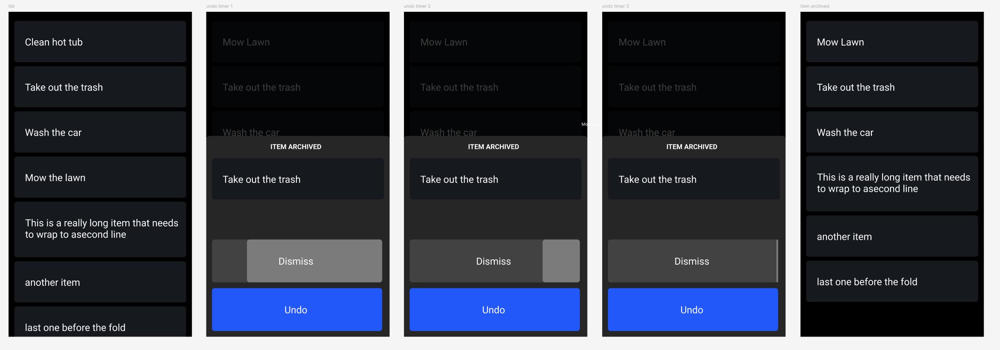

# Trello Display


A Python application that displays Trello cards from a specific list on a screen. Perfect for keeping track of tasks on a dedicated display.

## Features

- Displays Trello cards from a specific list
- Auto-sizing display that works in landscape (480×320) or portrait (320×480) mode
- Full-screen display with hidden mouse cursor
- Cards appear in dark rounded rectangles that grow vertically if text wraps
- Periodically refreshes to show the latest cards (every 2 minutes)
- Interactive task management: tap on a task to archive it with confirmation

## Installation

1. Clone this repository:
   ```
   git clone https://github.com/nikolausj1/trello_display.git
   cd trello_display
   ```

2. Install required dependencies:
   ```
   pip install pygame requests python-dotenv
   ```

3. Create a `trello_secrets.env` file with your Trello API credentials:
   ```
   API_KEY=your_trello_api_key
   API_TOKEN=your_trello_api_token
   LIST_ID=your_trello_list_id
   ```

## Usage

Run the application:
```
python trello_display.py
```

Press ESC to exit the application.

### Task Management

To archive a task:
1. Tap/click on any task in the display
2. A confirmation dialog will appear asking if you want to archive the task
3. Select "Yes" to archive the task or "No" to cancel
4. If archived, the task will be immediately removed from the display

### Auto-start on Boot (Raspberry Pi/Linux)

To have the application start automatically when your Raspberry Pi or Linux system boots:

1. Create an autostart desktop entry:
   ```
   mkdir -p ~/.config/autostart
   nano ~/.config/autostart/trello-display.desktop
   ```

2. Add the following content (adjust the path if needed):
   ```
   [Desktop Entry]
   Type=Application
   Name=Trello Display
   Exec=/home/your_username/path/to/trello_display.py
   Terminal=false
   X-GNOME-Autostart-enabled=true
   ```

3. Make the script executable:
   ```
   chmod +x /home/your_username/path/to/trello_display.py
   ```

4. Ensure the first line of your script includes the shebang:
   ```python
   #!/usr/bin/env python3
   ```

## Configuration

### Getting Trello API Credentials

1. Get your API Key from [https://trello.com/app-key](https://trello.com/app-key)
2. Generate a Token using the link provided on that page
3. To get your List ID, you can use the Trello API Explorer or add `.json` to the end of your board URL and search for the list name

### Display Configuration

The display automatically adjusts to your screen size. You can modify the following parameters in the code:

- `REFRESH_SECS`: How often to refresh the Trello data (default: 120 seconds)
- Font size and colors can be adjusted in the drawing section

## Dependencies

- pygame: For the graphical display
- requests: For API calls to Trello
- python-dotenv: For loading environment variables

## License

[MIT License](LICENSE)
