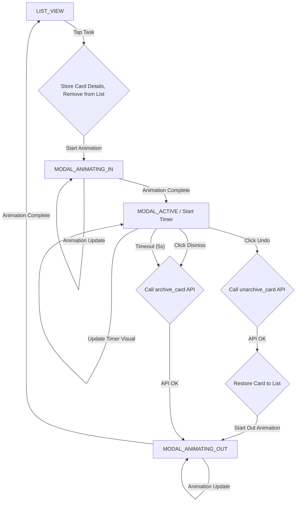

# Project: Trello Display - Enhanced Undo Modal

**Goal:** Implement a new undo modal that:
1.  Appears when a user taps a task item.
2.  Shows the tapped task card visually animating into the modal.
3.  Modal slides up from the bottom with a skrim overlay.
4.  Modal contains: "ITEM ARCHIVED" header, the task card, an "Undo" button, and a "Dismiss" button.
5.  "Dismiss" button acts as a 5-second visual timer; tapping it archives the item immediately.
6.  Timeout (5 seconds) archives the item.
7.  Tapping "Undo" moves the item back to the list.
8.  List items re-flow (animate up) only after an item is definitively archived.

**Technology:** Python with Pygame (with the understanding that a framework switch might be considered later for more complex UI/animations).

**High-Level Plan:**

1.  **Enhanced State Management:** Introduce new states to manage the modal's lifecycle and animations.
2.  **New Modal Component & Rendering:** Create a new function or heavily modify the existing one to draw the modal with its new design, including the animated task card and the timer on the "Dismiss" button.
3.  **Animation Logic (Pygame):** Implement animations for:
    *   Modal sliding up.
    *   Task card moving from the list into the modal.
    *   "Dismiss" button's countdown timer visual.
4.  **Event Handling:** Update the main event loop to manage interactions with the new modal, including button clicks and the timeout.
5.  **API Integration:** Ensure `archive_card` and `unarchive_card` are called at the correct times.

**Detailed Implementation Plan:**

**Phase 1: Setup and Core Modal Structure**

1.  **State Management Variables:**
    *   Introduce an `app_state` variable. Possible values:
        *   `'LIST_VIEW'` (normal display)
        *   `'MODAL_ANIMATING_IN'`
        *   `'MODAL_ACTIVE'`
        *   `'MODAL_ANIMATING_OUT'` (could be further divided for archive/undo if needed)
    *   Variables to store details of the card being archived/undone: `animating_card_details = {'id': None, 'text': None, 'original_rect': None, 'rendered_surface': None, 'original_list_index': -1}`.
    *   Variables for modal animation: `modal_anim_start_time`, `modal_current_y`, `modal_target_y`.
    *   Variables for card-to-modal animation: `card_anim_start_pos`, `card_anim_target_pos_in_modal`.
    *   `modal_dismiss_timer_start_time`.
    *   `UNDO_TIMEOUT = 5` (seconds).

2.  **Modify `show_undo_modal` (or create `draw_enhanced_undo_modal`):**
    *   **Parameters:** `screen`, `fonts` (dictionary of fonts if sizes vary), `modal_y_pos`, `animating_card_surface`, `animating_card_pos_in_modal`, `dismiss_progress` (0.0 to 1.0).
    *   **Skrim:** Draw a semi-transparent black surface (`pygame.SRCALPHA`) covering the whole screen *before* drawing the modal.
    *   **Modal Rectangle:**
        *   Calculate modal dimensions (e.g., 80% width, fixed height or percentage of screen height).
        *   Draw the main modal background rectangle at `(modal_x, modal_y_pos)` with rounded corners. Color: Dark grey (as in images).
    *   **Header:** Render "ITEM ARCHIVED" text at the top of the modal.
    *   **Animated Task Card:** Blit `animating_card_surface` at `animating_card_pos_in_modal`. This position will be relative to the modal's own coordinates.
    *   **"Undo" Button:**
        *   Draw a blue, rounded rectangle at the bottom of the modal.
        *   Render "Undo" text on it.
        *   Store its `pygame.Rect` for click detection.
    *   **"Dismiss" Button:**
        *   Draw a grey, rounded rectangle next to/aligned with the "Undo" button.
        *   Render "Dismiss" text on it.
        *   **Timer Visual:** Draw a lighter grey overlay on top of the "Dismiss" button. Its width will be `button_width * (1.0 - dismiss_progress)`. This overlay will shrink from left to right.
        *   Store its `pygame.Rect` for click detection.
    *   **Return:** A dictionary of clickable rects: `{'undo_button': undo_rect, 'dismiss_button': dismiss_rect}`.

**Phase 2: Animation and Interaction Logic**

1.  **Task Tap (in `LIST_VIEW` state):**
    *   When a task card is clicked:
        *   Set `app_state = 'MODAL_ANIMATING_IN'`.
        *   Store `card_id`, `text`, `original_rect` (from `card_rects`), and `original_list_index` in `animating_card_details`.
        *   Create a `rendered_surface` of the clicked card (can be a subsurface of the screen or re-render it).
        *   Set `modal_anim_start_time = time.time()`.
        *   Initialize `modal_current_y` to `HEIGHT` (off-screen bottom). `modal_target_y` will be its final on-screen position.
        *   Initialize `card_anim_start_pos` to the card's `original_rect.topleft`. `card_anim_target_pos_in_modal` will be its final position within the modal.
        *   The main `tasks` list should temporarily exclude this card from being drawn by the main `draw()` function (e.g., by removing it or marking it).

2.  **`MODAL_ANIMATING_IN` State (in main loop):**
    *   Calculate `elapsed_anim_time = time.time() - modal_anim_start_time`.
    *   Define an `ANIMATION_DURATION` (e.g., 0.3 seconds).
    *   `anim_progress = min(elapsed_anim_time / ANIMATION_DURATION, 1.0)`.
    *   **Modal Slide:** `modal_y_pos = HEIGHT - (HEIGHT - modal_target_y) * anim_progress`. (Ease function can be added).
    *   **Card Move:** Interpolate `current_card_x` and `current_card_y` from `card_anim_start_pos` to `(modal_x + card_target_x_offset_in_modal, modal_y_pos + card_target_y_offset_in_modal)` using `anim_progress`.
    *   Call `draw_enhanced_undo_modal` with these animated values (pass 0 for `dismiss_progress`).
    *   If `anim_progress == 1.0`:
        *   Set `app_state = 'MODAL_ACTIVE'`.
        *   Set `modal_dismiss_timer_start_time = time.time()`.

3.  **`MODAL_ACTIVE` State (in main loop):**
    *   `elapsed_dismiss_time = time.time() - modal_dismiss_timer_start_time`.
    *   `current_dismiss_progress = min(elapsed_dismiss_time / UNDO_TIMEOUT, 1.0)`.
    *   `modal_button_rects = draw_enhanced_undo_modal(...)` with `current_dismiss_progress`.
    *   **Event Handling (Mouse Click):**
        *   If "Undo" button clicked:
            *   Call `unarchive_card(animating_card_details['id'])`.
            *   If successful: Re-insert card details into `tasks` list at `animating_card_details['original_list_index']`.
            *   Set `app_state = 'MODAL_ANIMATING_OUT'` (or directly to `LIST_VIEW` if no out animation for undo).
        *   If "Dismiss" button clicked:
            *   Call `archive_card(animating_card_details['id'])`.
            *   Set `app_state = 'MODAL_ANIMATING_OUT'`. (Item is already removed from `tasks` list visually).
    *   **Timeout Check:**
        *   If `current_dismiss_progress == 1.0`:
            *   Call `archive_card(animating_card_details['id'])`.
            *   Set `app_state = 'MODAL_ANIMATING_OUT'`.

4.  **`MODAL_ANIMATING_OUT` State (in main loop):**
    *   (Similar to `MODAL_ANIMATING_IN` but reverses modal slide animation).
    *   Animate `modal_y_pos` from `modal_target_y` back to `HEIGHT`.
    *   The card inside the modal moves with it.
    *   When animation completes:
        *   Set `app_state = 'LIST_VIEW'`.
        *   The `tasks` list is now either with the card restored (undo) or permanently without it (archive).
        *   The main `draw(tasks)` will then redraw the list, and items will naturally "animate up" by reflowing into the empty space if a card was archived.

**Phase 3: Refinements and Integration**

1.  **Modify `draw(tasks)`:**
    *   When `app_state` is not `LIST_VIEW`, ensure `draw(tasks)` does not draw the `animating_card_details` if it's still technically in the `tasks` list. It's better to remove it from `tasks` when animation starts and add it back on undo.

2.  **Main Loop Update:**
    *   Structure the main loop around the `app_state`.
    *   Call `pygame.display.flip()` in each iteration.
    *   Ensure `time.sleep(0.016)` or similar for a target FPS (e.g., ~60fps for smoother animation). The current `time.sleep(0.1)` is too high for smooth animation.

**Mermaid Diagram (State Flow):**

**Key Considerations & Potential Challenges (Pygame):**

*   **Animation Smoothness:** Achieving perfectly smooth, interruptible animations in Pygame requires careful management of timing, state, and redrawing only necessary parts.
*   **Coordinate Systems:** Managing coordinates for the card animating from global list space to modal-relative space.
*   **Complexity:** The state logic for animations can become intricate.